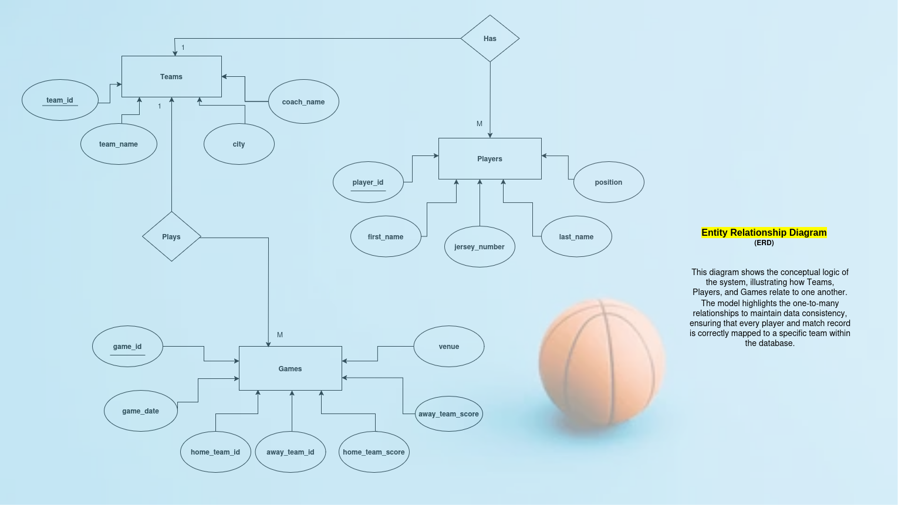
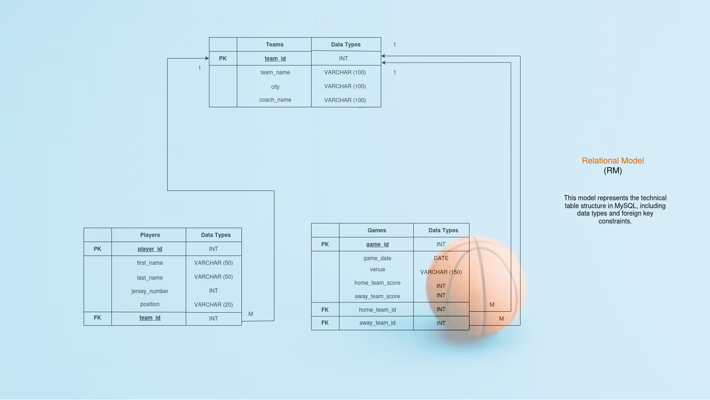

# 3x3 CourtMaster: Basketball Management System
> **CCCS 105 - Information Management 1 Final Project**
* A Python-based database application for managing 3x3 basketball league operations. Designed to access, store, and modify basketball tournament data.

---

## Table of Contents
1. [Introduction](#introduction)
2. [Project Objectives](#project-objectives)
3. [Business Rules](#business-rules)
4. [Database Models](#database-models)
5. [Project Overview](#project-overview)
6. [Setup and Installation](#setup--installation)
7. [Team Members and Roles](#team-members--roles)
8. [Dependencies](#dependencies)
9. [Running Instructions](#running-instructions)

---

## Introduction
### Background
**3x3 Basketball** is becoming very popular, but managing team rosters, player statistics, and game schedules manually is prone to errors. **3x3 CourtMaster** was developed to digitize this process, providing a centralized platform for tournament organizers to maintain accurate records.

### Problem Statement
Tournament organizers often face duplicate entries, inconsistent scoring data, and difficulty in retrieving historical player data. This application provides a searchable SCRUD (Search, Create, Read, Update, Delete) system integrated with a MySQL database.

### Scope
* **Includes:** Management of Teams, Players, and Games; Win/Loss tracking; and Data Export.
* **Excludes:** Real-time shot-clock integration, cloud hosting, and mobile app support.

### Target Users
* Tournament Administrators
* Team Coaches and Managers
* Database Management Students

---

## Technical Stack
* **Backend:** Python 3.x (Flask Framework)
* **Database:** MySQL (MariaDB via XAMPP)
* **Frontend:** HTML5, CSS, and JavaScript
* **Server:** Localhost (XAMPP Environment)

---

## Project Objectives

### Primary Objective
To develop a Flask and MySQL-based SCRUD application that efficiently manages basketball league data via a web-based interface.

### Secondary Objectives
* **Database Link:** Establish reliable connection to a MySQL database for data persistence.
* **Simple UI:** Create an intuitive and responsive user interface using Bootstrap.
* **Search Tool:** Implement live search functionality for quick record retrieval.
* **Security:** Implement a login system to secure database access.

---

## Business Rules

### Detailed Business Logic
* **User Authentication:** Users must log in to perform CRUD operations; sessions are required for access.
* **Database Connection:** Connects to MySQL `CCCS105` using default XAMPP credentials.
* **Constraints:** Each player must be assigned a unique jersey number per team. Teams cannot be deleted if they have active players.
* **Conditions:** MySQL server must be active; valid session data must exist to prevent unauthorized access.

---

## Database Models

### Entity Relationship Diagram (ERD)

*Illustrates the conceptual logic and business rules connecting Teams, Players, and Games.*

### Entity Descriptions
* **TEAMS:** Stores team name, city, and coach_name.
* **PLAYERS:** Stores first and last names, jersey numbers, positions, and their team_id.
* **GAMES:** Stores match dates, scores (home/away), and venue location.

### Relational Model

*The physical blueprint showing exact SQL data types (INT, VARCHAR, DATE) and Foreign Key (FK) constraints.*
* **Teams:** `team_id` (PK), `team_name`, `city`, `coach_name`.
* **Players:** `player_id` (PK), `first_name`, `last_name`, `jersey_number`, `position`, `team_id` (FK).
* **Games:** `game_id` (PK), `game_date`, `home_team_id` (FK), `away_team_id` (FK), `home_team_score`, `away_team_score`, `venue`.

---

## Project Overview

The application follows the **MVC (Model-View-Controller)** pattern:
* **Model:** MySQL Database (Data storage and management).
* **View:** HTML Templates (User Interface).
* **Controller:** Python Flask (Business Logic and Routing).

---

## Setup & Installation

1. **Clone Repository:** `git clone https://github.com/YOUR_USERNAME/3x3_courtmaster.git`.
2. **Virtual Environment:** Run `python -m venv venv` and activate it:
   * Windows: `venv\Scripts\activate`
   * Mac/Linux: `source venv/bin/activate`
3. **Install Dependencies:** `pip install -r requirements.txt`.
4. **Database Configuration:**
   * Open XAMPP and start Apache and MySQL.
   * Create a database named `CCCS105` in phpMyAdmin.
   * Import `database/schema.sql` first, followed by `database/Initial_data.sql`.
5. **Run Application:** Execute `python server.py`.
6. **Access:** Open `http://127.0.0.1:5000` in your browser.

---

## Team Members & Roles

| Member Name | Role | Responsibilities |
| :--- | :--- | :--- |
| Bongalos, Joshua Benedict B. | Documentation & Database Designer | Designing the ERD and Relational Model, creating the database schema and initial data, and writing the final technical documentation. |
| Mangente, Kurt Hearick B. | Frontend Developer | ERD/RM Design, Schema creation, and Normalization. |
| Pontanal, Jake Laurence L. | Backend Developer | Bootstrap design, JavaScript Search, and UI implementation. |

---

## Dependencies
* **Python Packages:** Flask, mysql-connector-python.
* **System Requirements:** Windows 10/11, Python 3.8+, MySQL 5.7+, Modern Browser (Chrome/Edge/Firefox).

---

## Running Instructions
* Start XAMPP MySQL.
* Open your terminal and type: `cd src` then `python server.py`.
* Open your browser to: `http://127.0.0.1:5000`.
* **Navigation:** Use the Sidebar/Navbar to switch between **Teams**, **Players**, and **Games**. Use the "Search" bar on the Players page for live filtering.

---
**Developed by:** 
* Bongalos, Joshua Benedict B.
* Mangente, Kurt Hearick B.
* Pontanal, Jake Laurence L.

**Course:** 2nd Year Computer Science
